# 🚀 Redis Streams Socket Server

High-performance Node.js Socket.IO server for processing millions of Redis Streams in real-time. Built with scalable architecture using SOLID principles.

## 📋 Table of Contents

- [Architecture Overview](#architecture-overview)
- [Classes and Components](#classes-and-components) 
- [Configuration](#configuration)
- [Setup and Installation](#setup-and-installation)
- [WebSocket Client Connection](#websocket-client-connection)
- [Room Management](#room-management)
- [Message Flow](#message-flow)
- [Performance Tuning](#performance-tuning)
- [Monitoring](#monitoring)
- [Deployment](#deployment)

---

## 🏗️ Architecture Overview

The server uses a **high-performance architecture** designed to handle millions of Redis Streams simultaneously:

```
┌─────────────────────────────────────────────────┐
│                Socket.IO Server                 │
├─────────────────────────────────────────────────┤
│  🏗️  ScalableRedisStreamApp (Main App)          │
│  ├── 🔍 StreamDiscovery (Find streams)          │
│  ├── 🗂️  StreamPoolManager (Group streams)       │
│  ├── ⚡ HighPerformanceProcessor (Process)       │
│  ├── 🔧 MessageProcessor (Parse messages)       │
│  ├── 📊 Logger (Logging)                        │
│  └── 🔄 LifecycleManager (Graceful shutdown)    │
└─────────────────────────────────────────────────┘
                        │
┌─────────────────────────────────────────────────┐
│                Redis Streams                    │
│  📨 chat.user.123    📨 chat.user.456          │
│  📨 notifications.*  📨 events.*               │
└─────────────────────────────────────────────────┘
                        │
┌─────────────────────────────────────────────────┐
│            WebSocket Clients                    │
│  🖥️  Web App    📱 Mobile App   🖥️  Admin      │
└─────────────────────────────────────────────────┘
```

---

## 🎯 Classes and Components

### 📁 **File Structure**
```
socket-server/
├── server.js                                    # Entry point
├── package.json                                 # Dependencies
├── .env.production                              # Production settings
└── src/
    ├── ScalableRedisStreamApp.js                # Main application
    ├── services/
    │   └── HighPerformanceRedisStreamService.js # Redis operations
    ├── managers/
    │   ├── StreamPoolManager.js                 # Pool management
    │   └── LifecycleManager.js                  # App lifecycle
    ├── processors/
    │   ├── HighPerformanceStreamProcessor.js    # Main processing logic
    │   └── MessageProcessor.js                  # Message parsing
    └── utils/
        └── Logger.js                            # Logging system
```

### 🏗️ **ScalableRedisStreamApp** (Main Application)
**Responsibility:** Application initialization, clustering, component coordination

**Key Methods:**
- `constructor(config)` - Initialize with configuration
- `start()` - Start application (cluster or worker)
- `_startCluster()` - Start cluster with multiple workers
- `_startWorker()` - Start single worker process
- `_shutdown()` - Graceful application shutdown

**Features:**
- **Clustering support** - Multiple worker processes for CPU scaling
- **Redis connection pooling** - Optimized Redis connections
- **Socket.IO optimization** - WebSocket-only transport for performance
- **Graceful shutdown** - Proper resource cleanup

### 🔍 **HighPerformanceRedisStreamService** (Redis Operations)
**Responsibility:** All Redis operations (SCAN, XREAD, XDEL)

**Key Methods:**
- `scanStreams()` - Non-blocking stream discovery using SCAN
- `readStreamsBatch()` - Batch reading from multiple streams
- `deleteMessagesBatch()` - Batch message deletion
- `isStream(key)` - Check if Redis key is a stream

**Optimizations:**
- Uses `SCAN` instead of `KEYS` for non-blocking discovery
- Batch operations for better performance
- Compatible with Redis 5.0+

### 🗂️ **StreamPoolManager** (Pool Management)
**Responsibility:** Organizing streams into processing pools

**Key Methods:**
- `addStream(streamName, priority)` - Add stream to queue
- `createProcessingPools()` - Create optimized processing pools
- `updateActivity(streamName)` - Update stream activity
- `cleanupInactiveStreams()` - Remove inactive streams

**Features:**
- **Priority system** - VIP streams processed first
- **Activity tracking** - Remove inactive streams after 1 hour
- **Memory optimization** - Automatic cleanup
- **Load balancing** - Distribute streams across pools

### ⚡ **HighPerformanceStreamProcessor** (Main Processing Logic)
**Responsibility:** Core stream processing and message handling

**Key Methods:**
- `start()` - Start stream processing
- `_startStreamDiscovery()` - Begin stream discovery
- `_startPoolProcessing()` - Begin pool processing
- `_processStreamMessages()` - Process messages from stream

**Processing Flow:**
1. **Discovery** - Find streams using SCAN
2. **Pooling** - Group streams into batches
3. **Reading** - Read messages via XREAD
4. **Processing** - Parse and send to Socket.IO
5. **Cleanup** - Delete processed messages

### 🔧 **MessageProcessor** (Message Parsing)
**Responsibility:** Parse and transform Redis Stream messages

**Key Methods:**
- `parseFields(fields)` - Convert Redis fields to object
- `parseJsonData(messageData)` - Parse JSON data
- `processMessage(messageId, fields, streamName)` - Full message processing

**Message Structure:**
```javascript
// Input from Redis Stream:
['event', 'user.message', 'data', '{"user_id": 123, "message": "Hello"}']

// Output for Socket.IO:
{
  from: 'service',
  message: { event: 'user.message', data: { user_id: 123, message: 'Hello' } },
  roomId: 'chat.user.123',
  event: 'user.message',
  messageId: '1727524800000-0'
}
```

### 📊 **Logger** (Logging System)
**Responsibility:** Structured logging with levels

**Log Levels:**
- `error` - Critical errors only
- `warn` - Warnings and errors
- `info` - General information (default)
- `debug` - Detailed debugging info

**Features:**
- Timestamp in every message
- Configurable log levels
- Structured logging support

### 🔄 **LifecycleManager** (Application Lifecycle)
**Responsibility:** Graceful shutdown and signal handling

**Handled Signals:**
- `SIGTERM` - Graceful shutdown
- `SIGINT` - Ctrl+C shutdown
- `uncaughtException` - Crash recovery
- `unhandledRejection` - Promise error handling

---

## ⚙️ Configuration

### 🔧 **Environment Variables**

#### **Redis Settings**
```bash
REDIS_HOST=localhost          # Redis server host
REDIS_PORT=6379              # Redis server port  
REDIS_PASSWORD=              # Redis password (optional)
REDIS_DB=0                   # Redis database number
```

#### **Performance Settings**
```bash
# Pool Configuration
POOL_SIZE=100                # Streams per pool (50-500)
MAX_POOLS=50                 # Maximum concurrent pools (10-100)
SCAN_COUNT=5000             # SCAN batch size (1000-10000)
MAX_STREAMS_PER_READ=100    # XREAD batch size (50-200)
MAX_CONCURRENT_POOLS=20     # Parallel pools (5-50)
BATCH_DELAY=10              # Delay between batches in ms (10-100)
MAX_MESSAGES_BATCH=100      # Messages per batch (50-1000)
```

#### **Clustering**
```bash
CLUSTER_ENABLED=true         # Enable Node.js clustering
CLUSTER_WORKERS=4           # Number of worker processes (1-16)
```

#### **Socket.IO**
```bash
SOCKETIO_REDIS_ADAPTER=true  # Redis adapter for clustering
MAX_ROOMS_PER_SOCKET=100    # Max rooms per socket connection
```

#### **Monitoring**
```bash
LOG_LEVEL=info              # debug, info, warn, error
STREAM_PATTERN=chats.*      # Pattern for your streams
PRIORITY_STREAMS=chat.vip.1,chat.vip.2  # Priority streams
```

### 📊 **Performance Settings by Load**

#### **Light Load (1K-10K streams):**
```env
POOL_SIZE=50
MAX_POOLS=10
MAX_CONCURRENT_POOLS=5
CLUSTER_WORKERS=2
```

#### **Medium Load (10K-100K streams):**
```env
POOL_SIZE=100
MAX_POOLS=25
MAX_CONCURRENT_POOLS=10
CLUSTER_WORKERS=4
```

#### **High Load (100K-1M streams):**
```env
POOL_SIZE=200
MAX_POOLS=50
MAX_CONCURRENT_POOLS=20
CLUSTER_WORKERS=8
```

#### **Extreme Load (1M+ streams):**
```env
POOL_SIZE=500
MAX_POOLS=100
MAX_CONCURRENT_POOLS=50
CLUSTER_WORKERS=16
NODE_OPTIONS="--max-old-space-size=8192"
```

---

## 🚀 Setup and Installation

### **1. Install Dependencies**
```bash
cd socket-server
npm install
```

### **2. Configure Environment**
```bash
# Copy production settings
cp .env.production .env

# Edit settings for your environment
nano .env
```

### **3. Start Server**

#### **Development (Single Process):**
```bash
npm start
```

#### **Production (Clustered):**
```bash
CLUSTER_ENABLED=true CLUSTER_WORKERS=4 npm start
```

#### **High Performance (Optimized):**
```bash
NODE_OPTIONS="--max-old-space-size=4096" \
CLUSTER_ENABLED=true \
CLUSTER_WORKERS=8 \
POOL_SIZE=200 \
MAX_CONCURRENT_POOLS=30 \
npm start
```

---

## 🌐 WebSocket Client Connection

### **1. Basic Connection**

#### **JavaScript (Browser/Node.js):**
```javascript
import { io } from 'socket.io-client';

const socket = io('http://localhost:3000', {
  transports: ['websocket'], // Use WebSocket only for performance
  timeout: 10000,
  forceNew: true
});

socket.on('connect', () => {
  console.log('Connected to socket server:', socket.id);
});

socket.on('disconnect', (reason) => {
  console.log('Disconnected:', reason);
});
```

#### **React Example:**
```jsx
import { useEffect, useState } from 'react';
import { io } from 'socket.io-client';

function useSocket() {
  const [socket, setSocket] = useState(null);
  const [connected, setConnected] = useState(false);

  useEffect(() => {
    const newSocket = io('http://localhost:3000', {
      transports: ['websocket']
    });

    newSocket.on('connect', () => {
      setConnected(true);
    });

    newSocket.on('disconnect', () => {
      setConnected(false);
    });

    setSocket(newSocket);

    return () => newSocket.close();
  }, []);

  return { socket, connected };
}
```

### **2. Error Handling**
```javascript
socket.on('connect_error', (error) => {
  console.error('Connection error:', error);
});

socket.on('error', (error) => {
  console.error('Socket error:', error);
});
```

---

## 🏠 Room Management

### **1. Join Room**
```javascript
// Join a specific stream/chat room
socket.emit('join-room', 'chat.user.123');

// Join multiple rooms
const rooms = ['chat.user.123', 'notifications.user.123', 'events.general'];
rooms.forEach(room => socket.emit('join-room', room));
```

### **2. Leave Room**  
```javascript
// Leave specific room
socket.emit('leave-room', 'chat.user.123');

// Leave all rooms (automatically on disconnect)
socket.disconnect();
```

### **3. Listen for Messages**
```javascript
// Listen for messages from any joined room
socket.on('room:message', (message) => {
  console.log('Received message:', {
    from: message.from,           // 'service'
    roomId: message.roomId,       // 'chat.user.123'
    event: message.event,         // 'user.message'
    messageId: message.messageId, // '1727524800000-0'
    data: message.message.data    // Parsed JSON data
  });
});
```

### **4. Room Limits**
- **Max rooms per socket:** 100 (configurable via `MAX_ROOMS_PER_SOCKET`)
- **Automatic cleanup:** Rooms are cleaned up on disconnect
- **Error handling:** Server sends error if room limit exceeded

---

## 🔄 Message Flow

### **1. Laravel → Redis Stream**
```php
// Laravel broadcasting (RedisStreamBroadcaster)
Redis::connection()->executeRaw([
    'XADD',
    'chat.user.123',           // Stream name (room)
    '*',                       // Auto-generate ID
    'event', 'user.message',   // Event type
    'data', '{"user_id": 123, "message": "Hello"}'  // JSON data
]);
```

### **2. Redis Stream → Socket Server**
```javascript
// Server processes stream:
// 1. Discovery: SCAN finds 'chat.user.123' stream
// 2. Pooling: Groups streams into batches
// 3. Reading: XREAD gets new messages
// 4. Processing: Parses and formats message
// 5. Broadcasting: Sends to Socket.IO room
// 6. Cleanup: XDEL removes processed message
```

### **3. Socket Server → WebSocket Client**
```javascript
// Client receives message:
socket.on('room:message', (message) => {
  // message.roomId = 'chat.user.123'
  // message.event = 'user.message'  
  // message.message.data = { user_id: 123, message: 'Hello' }
});
```

### **4. Complete Flow Example**

```mermaid
graph LR
    A[Laravel App] -->|XADD| B[Redis Stream]
    B -->|SCAN/XREAD| C[Socket Server]
    C -->|emit| D[WebSocket Client]
    C -->|XDEL| B
    
    subgraph "Redis Stream"
        B1["chat.user.123<br/>├── msg1: {event: 'user.message'}<br/>├── msg2: {event: 'user.typing'}<br/>└── msg3: {event: 'user.read'}"]
    end
    
    subgraph "Socket Server Processing"
        C1[Stream Discovery]
        C2[Pool Management]  
        C3[Message Processing]
        C4[Socket Broadcasting]
        C5[Message Cleanup]
    end
```


---

## 🎛️ Configuration Details

### **Performance Parameters**

| Parameter | Description | Recommended Values | Impact |
|-----------|-------------|-------------------|---------|
| `POOL_SIZE` | Streams per pool | 50-200 | Larger = less Redis calls, more memory |
| `MAX_POOLS` | Max concurrent pools | 10-100 | Higher = more parallelism |
| `MAX_CONCURRENT_POOLS` | Parallel processing | 5-50 | Higher = faster processing |
| `BATCH_DELAY` | Delay between batches | 10-100ms | Lower = higher CPU usage |
| `SCAN_COUNT` | SCAN batch size | 1000-10000 | Higher = fewer SCAN calls |

### **Memory vs Performance Trade-offs**

#### **Low Memory Setup:**
```env
POOL_SIZE=25          # Small pools
MAX_POOLS=10          # Few concurrent pools
SCAN_COUNT=500        # Small scan batches
CLUSTER_WORKERS=2     # Few workers
```

#### **High Performance Setup:**
```env
POOL_SIZE=500         # Large pools  
MAX_POOLS=100         # Many concurrent pools
SCAN_COUNT=10000      # Large scan batches
CLUSTER_WORKERS=16    # Many workers
```

### **Redis Optimization**
```conf
# redis.conf optimizations
maxclients 50000
tcp-keepalive 60
timeout 300
maxmemory-policy allkeys-lru
stream-node-max-entries 100
```

---

## 💻 WebSocket Client Connection

### **1. Basic JavaScript Client**
```javascript
// Initialize connection
const socket = io('ws://localhost:3000', {
  transports: ['websocket'],
  timeout: 10000
});

// Connection events
socket.on('connect', () => {
  console.log('✅ Connected:', socket.id);
  
  // Join user-specific rooms
  socket.emit('join-room', `chat.user.${userId}`);
  socket.emit('join-room', `notifications.user.${userId}`);
});

socket.on('disconnect', (reason) => {
  console.log('❌ Disconnected:', reason);
  // Automatic cleanup - no manual action needed
});

// Error handling
socket.on('connect_error', (error) => {
  console.error('Connection failed:', error);
});

socket.on('error', (error) => {
  console.error('Socket error:', error);
});
```

### **2. React Hook Example**
```jsx
import { useEffect, useState, useRef } from 'react';
import { io } from 'socket.io-client';

function useRedisStreamSocket(userId) {
  const [socket, setSocket] = useState(null);
  const [connected, setConnected] = useState(false);
  const [messages, setMessages] = useState([]);
  const socketRef = useRef(null);

  useEffect(() => {
    // Initialize socket connection
    socketRef.current = io('ws://localhost:3000', {
      transports: ['websocket'],
      timeout: 10000
    });

    const currentSocket = socketRef.current;

    // Connection handlers
    currentSocket.on('connect', () => {
      setConnected(true);
      
      // Auto-join user rooms
      const rooms = [
        `chat.user.${userId}`,
        `notifications.user.${userId}`,
        `events.user.${userId}`
      ];
      
      rooms.forEach(room => {
        currentSocket.emit('join-room', room);
      });
    });

    currentSocket.on('disconnect', () => {
      setConnected(false);
    });

    // Message handler
    currentSocket.on('room:message', (message) => {
      setMessages(prev => [...prev, {
        id: message.messageId,
        room: message.roomId,
        event: message.event,
        data: message.message.data,
        timestamp: new Date()
      }]);
    });

    setSocket(currentSocket);

    // Cleanup
    return () => {
      currentSocket.close();
    };
  }, [userId]);

  const joinRoom = (roomId) => {
    if (socket && connected) {
      socket.emit('join-room', roomId);
    }
  };

  const leaveRoom = (roomId) => {
    if (socket && connected) {
      socket.emit('leave-room', roomId);
    }
  };

  return {
    socket,
    connected,
    messages,
    joinRoom,
    leaveRoom
  };
}

// Usage in component
function ChatComponent({ userId }) {
  const { socket, connected, messages, joinRoom, leaveRoom } = useRedisStreamSocket(userId);

  const handleJoinChat = (chatId) => {
    joinRoom(`chat.${chatId}`);
  };

  return (
    <div>
      <div>Status: {connected ? '🟢 Connected' : '🔴 Disconnected'}</div>
      
      {messages.map(msg => (
        <div key={msg.id}>
          <strong>{msg.room}:</strong> {JSON.stringify(msg.data)}
        </div>
      ))}
    </div>
  );
}
```

### **3. Vue.js Example**
```javascript
// Vue 3 Composition API
import { ref, onMounted, onUnmounted } from 'vue';
import { io } from 'socket.io-client';

export function useSocket(userId) {
  const socket = ref(null);
  const connected = ref(false);
  const messages = ref([]);

  onMounted(() => {
    socket.value = io('ws://localhost:3000', {
      transports: ['websocket']
    });

    socket.value.on('connect', () => {
      connected.value = true;
      socket.value.emit('join-room', `chat.user.${userId}`);
    });

    socket.value.on('disconnect', () => {
      connected.value = false;
    });

    socket.value.on('room:message', (message) => {
      messages.value.push(message);
    });
  });

  onUnmounted(() => {
    if (socket.value) {
      socket.value.close();
    }
  });

  const joinRoom = (roomId) => {
    if (socket.value && connected.value) {
      socket.value.emit('join-room', roomId);
    }
  };

  return {
    socket: socket.value,
    connected,
    messages,
    joinRoom
  };
}
```

---

## 🏠 Room Management

### **Room Naming Convention**
```javascript
// Recommended patterns:
'chat.user.{userId}'           // User private chat
'chat.room.{roomId}'           // Group chat room
'notifications.user.{userId}'   // User notifications  
'events.global'                // Global events
'admin.{adminId}'              // Admin channels
```

### **Room Operations**

#### **Join Room:**
```javascript
socket.emit('join-room', 'chat.user.123');

// Server response handling
socket.on('error', (error) => {
  if (error.message === 'Max rooms limit reached') {
    console.warn('Cannot join more rooms');
  }
});
```

#### **Leave Room:**
```javascript
socket.emit('leave-room', 'chat.user.123');
```

#### **Get Current Rooms:**
```javascript
// Client-side tracking
let joinedRooms = new Set();

socket.on('connect', () => {
  joinedRooms.clear();
});

function joinRoom(roomId) {
  socket.emit('join-room', roomId);
  joinedRooms.add(roomId);
}

function leaveRoom(roomId) {
  socket.emit('leave-room', roomId);
  joinedRooms.delete(roomId);
}
```

### **Room-based Message Filtering**
```javascript
socket.on('room:message', (message) => {
  switch(message.roomId) {
    case `chat.user.${userId}`:
      handlePrivateMessage(message);
      break;
      
    case `notifications.user.${userId}`:
      showNotification(message);
      break;
      
    case 'events.global':
      handleGlobalEvent(message);
      break;
      
    default:
      console.log('Unknown room:', message.roomId);
  }
});
```

---

## 📨 Message Structure

### **Incoming Message Format**
```javascript
{
  from: 'service',                    // Message source
  message: {                          // Original Redis Stream data
    event: 'user.message',           // Event type
    data: {                          // Parsed JSON payload
      user_id: 123,
      message: 'Hello World',
      timestamp: '2025-09-28T10:30:00Z'
    }
  },
  roomId: 'chat.user.123',           // Stream/room name
  event: 'user.message',             // Event type (duplicate for convenience)
  messageId: '1727524800000-0'       // Redis Stream message ID
}
```

### **Message Types Examples**

#### **Chat Message:**
```javascript
{
  event: 'chat.message',
  data: {
    user_id: 123,
    message: 'Hello everyone!',
    chat_room_id: 456,
    timestamp: '2025-09-28T10:30:00Z'
  }
}
```

#### **User Status:**
```javascript
{
  event: 'user.status',
  data: {
    user_id: 123,
    status: 'online',
    last_seen: '2025-09-28T10:30:00Z'
  }
}
```

#### **Notification:**
```javascript
{
  event: 'notification.new',
  data: {
    notification_id: 789,
    user_id: 123,
    title: 'New message',
    body: 'You have received a new message',
    type: 'message'
  }
}
```

---

## 📈 Performance Tuning

### **Monitoring Key Metrics**
- **Processing speed:** Should be >100 messages/sec for good performance
- **Average latency:** Should be <200ms for good user experience
- **Error rate:** Should be <1% for stable operation
- **Memory usage:** Monitor for memory leaks

### **Scaling Strategies**

#### **Vertical Scaling (Single Server):**
```bash
# Increase worker processes
CLUSTER_WORKERS=16

# Increase pool sizes
POOL_SIZE=500
MAX_POOLS=100

# Optimize memory
NODE_OPTIONS="--max-old-space-size=8192"
```

#### **Horizontal Scaling (Multiple Servers):**
```bash
# Use Redis adapter for Socket.IO
SOCKETIO_REDIS_ADAPTER=true

# Load balancer configuration
upstream socket_servers {
    server server1:3000;
    server server2:3000; 
    server server3:3000;
}
```

### **Troubleshooting Performance Issues**

#### **High Latency (>1000ms):**
- Reduce `POOL_SIZE` to 50-100
- Increase `MAX_CONCURRENT_POOLS` to 20-30
- Reduce `BATCH_DELAY` to 10ms
- Check Redis server performance

#### **High Memory Usage:**
- Reduce `MAX_POOLS` to 25-50
- Enable cleanup: `PRIORITY_STREAMS` for important streams only
- Monitor inactive stream cleanup

#### **High CPU Usage:**
- Increase `BATCH_DELAY` to 50-100ms
- Reduce `MAX_CONCURRENT_POOLS` to 10-15
- Use fewer `CLUSTER_WORKERS`

---

## 🐳 Deployment

### **Docker Setup**
```dockerfile
# Dockerfile
FROM node:18-alpine
WORKDIR /app

COPY package*.json ./
RUN npm ci --only=production

COPY . .
EXPOSE 3000

CMD ["npm", "start"]
```

### **Docker Compose**
```yaml
version: '3.8'
services:
  redis:
    image: redis:7-alpine
    ports:
      - "6379:6379"
    volumes:
      - redis_data:/data
      
  socket-server:
    build: .
    ports:
      - "3000:3000"
    environment:
      - CLUSTER_ENABLED=true
      - CLUSTER_WORKERS=4
      - REDIS_HOST=redis
      - POOL_SIZE=200
      - MAX_CONCURRENT_POOLS=20
    depends_on:
      - redis
    deploy:
      replicas: 2
      
volumes:
  redis_data:
```

### **Production Checklist**
- [ ] Set `LOG_LEVEL=warn` for production
- [ ] Enable clustering: `CLUSTER_ENABLED=true`  
- [ ] Configure Redis persistence
- [ ] Set up monitoring (Prometheus/Grafana)
- [ ] Configure load balancer
- [ ] Set up SSL/TLS termination
- [ ] Configure firewall rules
- [ ] Set up log rotation

---

## 🔍 Entities and Data Types

### **Stream Entity**
```javascript
// Stream represents a communication channel
{
  name: 'chat.user.123',           // Unique identifier
  type: 'stream',                  // Redis type
  lastActivity: Date.now(),        // Last message timestamp
  priority: 0,                     // Priority level (0=normal, 1=high)
  messageCount: 1205               // Approximate message count
}
```

### **Pool Entity**
```javascript
// Pool groups streams for batch processing
{
  id: 'pool_1',                    // Pool identifier
  streams: ['chat.1', 'chat.2'],   // Streams in this pool
  size: 100,                       // Max streams per pool
  isActive: true,                  // Currently being processed
  lastProcessed: Date.now()        // Last processing time
}
```

### **Message Entity**
```javascript
// Message from Redis Stream
{
  messageId: '1727524800000-0',    // Redis Stream message ID
  streamName: 'chat.user.123',     // Source stream
  event: 'user.message',           // Event type
  data: {                          // Parsed payload
    user_id: 123,
    message: 'Hello',
    timestamp: '2025-09-28T10:30:00Z'
  },
  processedAt: Date.now(),         // Processing timestamp
  clientsCount: 5                  // Number of clients that received message
}
```

---

## 🚨 Error Handling

### **Common Errors and Solutions**

#### **"ERR syntax error" in SCAN:**
**Cause:** Using `TYPE 'stream'` option with Redis < 6.0  
**Solution:** Server automatically handles this by filtering types separately

#### **"ERR wrong number of arguments for 'xadd'":**
**Cause:** Incorrect Laravel RedisStreamBroadcaster configuration  
**Solution:** Use `executeRaw()` method in Laravel:
```php
Redis::connection()->executeRaw([
    'XADD', $channel, '*',
    'event', $event,
    'data', json_encode($payload)
]);
```

#### **High Memory Usage:**
**Cause:** Too many streams tracked in memory  
**Solution:** Reduce `MAX_POOLS` and enable cleanup

#### **"Max rooms limit reached":**
**Cause:** Socket trying to join >100 rooms  
**Solution:** Increase `MAX_ROOMS_PER_SOCKET` or implement room management

---

## 🎯 Best Practices

### **Client-Side:**
1. **Use WebSocket only:** `transports: ['websocket']`
2. **Implement reconnection:** Handle disconnect events
3. **Limit room subscriptions:** Don't join too many rooms
4. **Handle errors:** Always implement error handlers
5. **Clean disconnect:** Call `socket.disconnect()` on app close

### **Server-Side:**
1. **Monitor performance:** Watch latency and throughput
2. **Use clustering:** Enable for production workloads
3. **Configure Redis properly:** Use optimized Redis settings
4. **Implement health checks:** Add `/health` endpoint
5. **Log important events only:** Avoid excessive logging

### **Laravel Integration:**
1. **Use proper broadcasting:** Set `BROADCAST_CONNECTION=stream`
2. **Optimize Redis connection:** Use connection pooling
3. **Handle broadcasting errors:** Implement try-catch blocks
4. **Use appropriate stream names:** Follow naming conventions

---

## 📞 Support and Troubleshooting

### **Debug Mode**
```bash
# Enable debug logging
LOG_LEVEL=debug npm start

# You'll see detailed logs for:
# - Stream discovery process
# - Pool creation and management  
# - Individual message processing
# - Redis operations
# - Socket connections/disconnections
```

### **Performance Testing**
```javascript
// Simple load test
const io = require('socket.io-client');

async function loadTest() {
  const sockets = [];
  const numConnections = 1000;
  
  for (let i = 0; i < numConnections; i++) {
    const socket = io('ws://localhost:3000', {
      transports: ['websocket']
    });
    
    socket.on('connect', () => {
      socket.emit('join-room', `test.room.${i % 100}`);
    });
    
    sockets.push(socket);
  }
  
  console.log(`Created ${numConnections} socket connections`);
}
```

### **Health Check Endpoint**
```javascript
// Add to ScalableRedisStreamApp._setupEventHandlers()
this.app.get('/health', (req, res) => {
  const metrics = this.streamProcessor.getMetrics();
  res.json({
    status: 'healthy',
    uptime: metrics.uptime,
    messagesProcessed: metrics.messagesProcessed,
    connectedClients: this.io.engine.clientsCount,
    redisConnected: this.redis.status === 'ready'
  });
});
```

---

## 📚 Additional Resources

- **ioredis Documentation:** https://github.com/redis/ioredis
- **Socket.IO Documentation:** https://socket.io/docs/
- **Redis Streams Guide:** https://redis.io/topics/streams-intro
- **Node.js Clustering:** https://nodejs.org/api/cluster.html

---

**Built with ❤️ for high-performance real-time applications**
